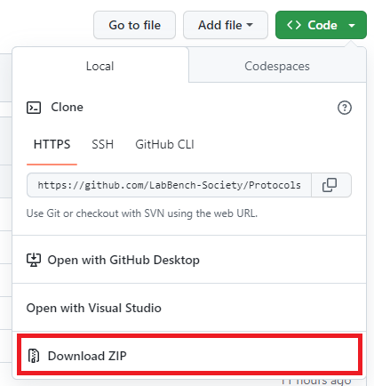
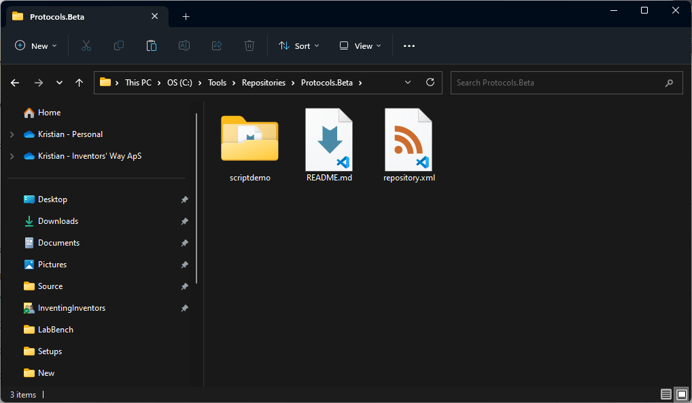

# LabBench Beta Program [beta.labbench.io]

This repository contains protocols that are intended for testing Beta versions of LabBench. Beta versions of LabBench are versions of LabBench that are not yet officially released but are being tested by research groups collaborating with Inventors' Way as part of the LabBench Beta Program. The purpose of the LabBench Beta Program is a collaboration between researchers at academic institutions and the developers of LabBench that aims to create novel and open methods and devices for neuroscience research.

Currently, the following laboratories and sites participate in the LabBench Beta Program:

| Site  | Principal Investigator  | Area         |
|-------|----------|:----|
| [Integrative Neuroscience Research Group, Aalborg University](https://vbn.aau.dk/en/organisations/integrative-neuroscience) | [Carsten D. Mørch]() | Research into the neuroscience of pain that aims at understanding the basic mechanisms of the pain system. Development of methods to investigate how nociceptors generate and mediate pain signals in healthy humans and pathological situations. <br /> **Beta Program focus: Development of functionality in LabBench for Perception Threshold Tracking.**
| [Steno Diabetes Center Northen Jutland](https://stenodiabetescenter.rn.dk/Forskning/Forskningsprojekter-i-SDCN/MEDON) | [Johan Røikjer]() | Research aimed at early detection of diabetic polyneuropathy which includes the use of perception threshold tracking. <br /> **Beta Program focus: Development of functionality in LabBench for Perception Threshold Tracking.** |
| [Translational Biomarkers in Pain and Precision Medicine Research Group, Aalborg University]() | [Laura Petrini](https://vbn.aau.dk/da/persons/112436)| Research in how to assess pain in elderly and vulnerable populations. <br /> **Beta Program focus: Development of functionality in LabBench for studying pain catastrophizing** |
| [?]() | [Sabata Gervasio]() | Research on sensory thresholds and sensory processing in children with autism. <br /> **Beta Program focus: Development of functionality in LabBench for studying sensory processing, such as auditory and tactile psychophysical tests, and functionality for recording auditory and tactile evoked potentials** |

If LabBench does not adequately support your research and you would like to see that change, then write to (help@labbench.io) to become a member of this Beta program. By participating in this program, you will gain access to versions of LabBench before they become generally available, have its development tailored to fit your exact research needs, and have access to extensive support in running your experiments. In return the LabBench developers gain access to your expert knowledge and help in making LabBench better for your area of research.

## LabBench Beta

### What is the Beta version of LabBench

The Beta version of LabBench is what we call a release candidate (rc) for the next upcoming release of LabBench; this means that it has yet to go through the official release process and contains experimental functionality yet to mature enough for general use.

### Installation

Installation and use of LabBench Beta is done in close collaboration with the developers of LabBench. When you need to install LabBnech Beta you will receive a download link to an zip file containing the executable files for the program. However, as it is not officially released there is not an installer for the program. Instead to use LabBench Beta you will go through the following steps the first time you install LabBench Beta on your lab computer.

**FIRST TIME INSTALLATION:**

1. Unpack the zip file to ```C:\Tools\LabBench```
2. Mark the labbench.exe file in that directory, and press Ctrl + C. 
3. Goto the Desktop, right click on the desktop and choose "Paste shortcut". Do this twice.
4. Setup one shortcut to start the LabBench Designer program:
    1. Mark the shortcut and press F2. Rename it to say ```LabBench Designer (Beta)```.
    2. Right click the shortcut and click on Properties.
    3. Change Target to: ```C:\Tools\LabBench\LabBench.exe designer -p C:\LabBeta```. If you kept the path ```C:\Tools\LabBench``` in step 1, you can copy paste this line from here to the Target property in the shortcut.
    4. Test the shortcut by double clicking it and see that it start the LabBench Designer. Close the program before you proceed to step 5 in this installation procedure.
5. Setup the other shortcut to start the LabBench Runner program:
    1. Mark the shortcut and press F2. Rename it to say ```LabBench Runner (Beta)```.
    2. Right click the shortcut and click on Properties.
    3. Change Target to: ```C:\Tools\LabBench\LabBench.exe runner -p C:\LabBeta```. If you kept the path ```C:\Tools\LabBench``` in step 1, you can copy paste this line from here to the Target property in the shortcut.
    4. Test the shortcut by double clicking it and see that it start the LabBench Runner. Close the program before you proceed to step 5 in this installation procedure.

**UPDATING LABBENCH BETA:**

To update LabBench Beta.

1. Delete all files in ```C:\Tools\LabBench```
2. Unpack the zip file to ```C:\Tools\LabBench```

## LabBench Beta Protocol Repository

To use protocols from the LabBench Beta Protocol Repository, you will need to add this repository to LabBench. There are two methods by which LabBench can access a repository:

1. The repository is served from a  web server and is accessed through its URL. The URL of the LabBench Beta Protocol Repository is [https://labbench-society.github.io/Protocols.Beta/](https://labbench-society.github.io/Protocols.Beta/).
2. The repository is available as a folder on the lab computer or as a folder on a network.

Method 1 can be used if you do not need to modify your protocol. Method 1 may be the case if the LabBench developers handle all of the protocol development for you as part of the LabBench Beta program. Method 2 is needed if you want to change the protocol by yourself.

Follow the URL in Method 1 for instructions on adding the repository to LabBench when accessed directly from Github. The rest of this guide assumes that you will need to change the protocols and will access the repository with Method 2.

### Access to the content of the repository

#### Download from Github

To download a copy of the LabBench Beta Repository, click the ```<> Code``` button in the top right corner of this page. This opens a dropdown menu, in that menu select Download Zip:



Once you have downloaded the zip file with the repository's contents, the contents of a subdirectory (docs) in this zip file must be copied to a directory on your computer. We suggest placing it in ```C:\Tools\Repositories\Protocols.Beta```. 

Multiple directories exist within the downloaded zip file, as this file contains the entire site content you are now reading, including this guide.

The actual repository is located in the docs subfolder of this zip file, and it is the content of that directory that must be placed in the C:\Tools\Repositories\Protocols.Beta folder. If done correctly, the contents of this folder will look something like this once you copied the contents of the docs folder:



When you perform this installation, the repository hopefully contains many more subfolders (protocols); however, most importantly, the ```repository.xml``` must be located in the root of the ```C:\Tools\Repositories\Protocols.Beta``` folder, as it is this file that turns a folder into a LabBench Repository.

#### Cloning or forking the repository from Github

Without question, the best way to access a copy of the repository is to clone it (for members of the LabBench Society) or fork it (outside collaborators), as this will allow you to submit pull requests to have your changes merged back into the official repository. This way also provides a much higher degree of certainty that the version of your protocol will be preserved with no ambiguities about the protocol when you are to write your scientific papers.

If this is your preferred way of working with the repository, it means you are an accomplished Git user, and we will not insult you by providing a guide on how to Clone or Fork repositories.

If you are unfamiliar with Git but this has sparked your curiosity, [here](https://www.cprime.com/resources/blog/the-7-best-git-tutorials-to-get-you-started-quickly/) is a list of excellent Git tutorials. This guide is from the point of view of a software developer. Still, there are many similarities between the demands for version control and reproducibility in software development and scientific studies. 

### Adding the repository to LabBench


### Contributing your changes back to the LabBench Beta Protocol repository

Once your protocol is perfected and ready for your study, you are encouraged to submit the final protocol back to the LabBench Beta Protocol repository if you want the protocol saved for posterity.

How to do this depends on how you obtained a copy of the repository:

1. [Download from Github]: Zip the your copy of the repository and place it in a storage that allows you to send a link to this file (such as Sharepoint or Dropbox (preferred). Then send this link to ```help@labbench.io```.
2. [Cloning or Forking the repository] Submit a pull request. 

