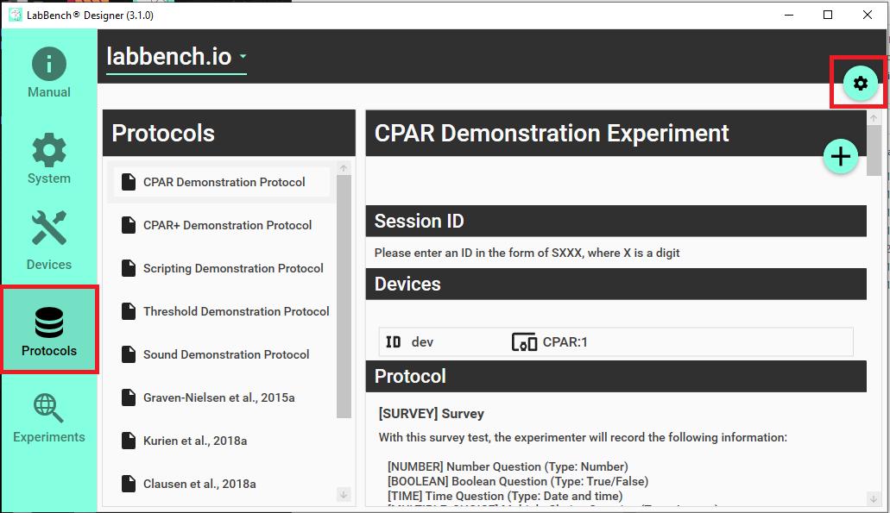
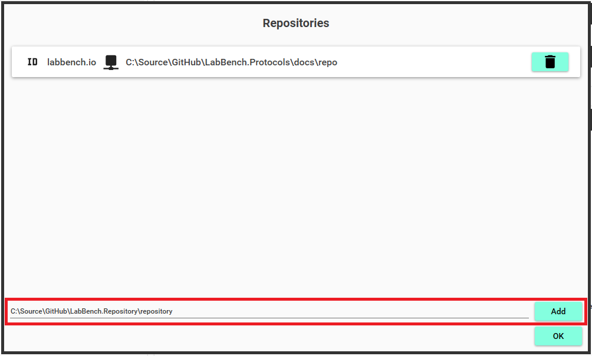

# LabBench.Repository

A LabBench Protocol Repository is a collection of protocols that defines experimental procedures to be performed in experimental studies. A LabBnech Protocol Repository can be used to store, manage, and access a set of protocols that are used by a single research group or which is made publicly available for all scientists. 

LabBench Protocol Repositories can be used to ensure that the protocols used for research studies are well-defined, consistent, and up-to-date.

# How to use this Repository Template

## 1. Download or clone the contents of this template repository

In top right hand corner of the page you are currently reading there is a Code button. Click on this button and choose Download ZIP (this is marked with a red box in the figure below).


This will download all the code in this repository to your computer as a zip file. Once you downloaded the contents of this repository to your computer, unzip the file to a folder of your choice on your computer or network drive.

## 2. Change all repository IDs within the template repository

This template repository has the ID = ```example.labbench.io``` which is found in the ID attributes in the following files:

1. repository.xml which is located in the repository folder.
2. *.expx files in all the protocol subfolders with the repository folder.

Before you can use this repository template as the starting point for your own LabBench Repository you must change these IDs to a unique ID of your own choice.

For example, the Integrative Neuroscience research group at Aalborg University, could use ```integrative-neuroscience.aau.dk```. By using the domain for your organization as part of the ID you garenteee it will be unique as domain names are garanteed to be unique.

## 3. Decide on how to distribute your repository

For LabBench to be able to use a LabBench Protocol Repository it must be able to access the files in the repository. This can be achieved by either storing the repository locally in which case LabBench can access the file throught the windows file system. 

This can either be a folder on the local harddrive or it could be on a network share. 

LabBench can also access the files by downloading them over the internet. This means that if you have a webserver you can upload all the files of the repository to the webserver.

## 4. Add your new repository to your LabBench system

After you created your LabBench Protocol Repository, you must add it to your LabBench system in order to install and use protocols from this repository.

1. Open the LabBench Designer program.
2. Select the Protocols page and click the configure button (the cog-wheel icon):

3. In the resulting dialog, enter the folder path or URL of the location of your repository, and click the ADD button. 

4. Click the OK button.

When the steps above has been completed, you can choose your repository from the drop-down list on the Protocols page and install protocols from your repository.

# Recommended tools for working with LabBench Protocols and Repositories

To set up experiments you will need to write experiment and protocol definition files, which are text files in a very specific format. LabBench is very strict with this format, any errors in one of these files will cause LabBench to reject the file and give an error.

While you can use any text editor to write these files, it will be easier to write these files if you use a text editor that understands the format of these files, so it can assist you in writing them and provide you with feedback immediately if you make an error.

An tool for editing these files would be to install [Visual Studio](https://visualstudio.microsoft.com/vs/ "Code faster. Work smarter. Create the future with the best-in-class IDE."), which can provide code completion (see below) when you write LabBench protocols. Code completion makes it substantially easier to write LabBench protocols.

# What is in a LabBench Protocol Repository

First the most fundamental rule about LabBench Protocol Repositories:

1. What turns a folder into a LabBench Protocol Repository is that this folder MUST contain a ```repository.xml``` file that specifies the protocols within this repository.

This ```repository.xml``` file is what is loaded/downloaded by LabBench in order to provide the list of available protocols on the Protocols page in the LabBench Designer.

## Structure of a LabBench Protocol Repository

To Be Written (for now please see the repository folder, which contains an example protocol repository that can be used as a starting point for your own repository)

## Contents of a protocol

To Be Written (for now please see the subfolders to the repository folder, which contains examples of LabBench protocols)

## What is XML files

XML (Extensible Markup Language) is a markup language that is used to structure, store, and transport data. XML files are text files that use XML tags to define the structure and content of the data they contain. These tags allow the data to be organized into a hierarchical structure, with different levels of information corresponding to different levels of the hierarchy. XML files can be used to store a wide range of different types of data, including text, numbers, images, and other multimedia content. XML files are often used to exchange data between different systems or applications, as they provide a standardized format that can be easily read and interpreted by a variety of different programs.

Here is an example of an XML file that uses attributes to store information about books in a library:

```xml
<library>
  <book id="1" available="true">
    <title>The Catcher in the Rye</title>
    <author>J.D. Salinger</author>
    <genre>Fiction</genre>
    <year>1951</year>
  </book>
    <title>The Great Gatsby</title>
    <author>F. Scott Fitzgerald</author>
    <year>1925</year>
  </book>
  <book id="3" available="true">
    <title>Moby-Dick</title>
    <author>Herman Melville</author>
    <genre>Fiction</genre>
    <year>1851</year>
  </book>
</library>
```

In this example, each <book> element has two attributes: id and available. The id attribute provides a unique identifier for each book, while the available attribute indicates whether the book is currently available for checkout from the library. 

In XML, an attribute is a piece of metadata that is associated with an element and provides additional information about the element. An attribute is specified using name-value pairs within the opening tag of the element. For example, the following XML element uses an attribute to provide a unique identifier for the element:

```xml
<book id="1">
  ...
</book>
```

In this example, the book element has an id attribute with a value of 123456. This attribute provides a way to identify the specific book that is being described in the element. Attributes are a useful way to include additional information about an element in an XML file, without adding additional levels to the hierarchical structure of the file. They can be used to provide metadata or other information that is associated with an element, but that is not part of the element's main content.

Here is a more relevant example; the repository.xml which defines the contents of a LabBench Repository:

```xml
<?xml version="1.0" encoding="utf-8" ?>
<repository xmlns:xsi="http://www.w3.org/2001/XMLSchema-instance"
            xsi:schemaLocation="http://labbench.io https://labbench.io/xsd/dev/repository.xsd"
            id="example.labbench.io">
    <protocols>
        <protocol id="cpardemo"
                  location="CPARDEMO\"
                  protocol="cpardemo.prtx"
                  name="CPAR Demonstration Protocol" />

        <protocol id="scriptdemo"
                  location="SCRIPTDEMO\"
                  protocol="scriptdemo.prtx"
                  name="Scripting Demonstration Protocol" />

        <protocol id="thrdemo"
                  location="THRDEMO\"
                  protocol="thrdemo.prtx"
                  name="Threshold Demonstration Protocol" />

        <protocol id="sounddemo"
                  location="SOUNDDEMO\"
                  protocol="sounddemo.prtx"
                  name="Sound Demonstration Protocol" />
    </protocols>
</repository>
```

This repository XML file contains a list of protocols that are available in a particular repository. The file begins with an XML declaration that specifies the version of XML and the character encoding used in the file. 

The file then defines a repository element that includes several attributes, including an id attribute that identifies the repository. Within the repository element, there are a protocol elements each of which describes a different protocol that is available in the repository. 

Each protocol element includes several attributes that provide information about the protocol, such as its location, file name, and a description of its purpose. This XML file uses a hierarchical structure to organize the information about the protocols, with the repository element at the top level and the protocol elements at a lower level.

Despite the content of the two examples used in this explanation are very different; 

1. a catalog of books in a library, and
2. and an exampple of the actual format that LabBench uses to store information about the protocols in a repository.

Both examples are written in XML, which is a simple text based formats where you only need to know two fundamental concepts in order to write valid XML:

1. XML Elements: in XML, an element is a structural unit that is used to organize and contain data. An element consists of a start tag, content, and an end tag. The start and end tags define the boundaries of the element, and the content is the data that is contained within the element. Elements can contain other elements, as well as text, numbers, and other types of data. Elements are an important part of the structure of an XML document, and they provide a way to organize and group related data.
2. XML Attributes: In XML, an attribute is a piece of metadata that is associated with an element and provides additional information about the element. An attribute is specified using name-value pairs within the opening tag of the element. Attributes are a useful way to include additional information about an element in an XML file, without adding additional levels to the hierarchical structure of the file. They can be used to provide metadata or other information that is associated with an element, but that is not part of the element's main content.

With these two concepts you can write valid XML. However, as XML is a general purpose format that can be used to describe any data set in a human and machine readable format, you must also know what are valid elements and attributes for the files that LabBench needs for repositories and experimental protocols.

However, you do not need to memorize these as with the right tools (such as Visual Studio Community Edition) you can get what is known as code completion. Code completion is a feature of many code editors and integrated development environments (IDEs) that will help you to write code more quickly and accurately. When you begin typing a piece of code, the code editor or IDE will display a list of possible completions based on the characters that have been typed so far. You can then choose one of the suggested completions, which the editor or IDE will automatically insert into the code. This can save you time and effort by reducing the need to type out long or complex code constructs. Code completion will also help prevent errors by suggesting only valid completions based on the context of the code.

In the repository.xml example above code completion is enabled by the following lines:

```xml
<repository xmlns:xsi="http://www.w3.org/2001/XMLSchema-instance"
            xsi:schemaLocation="http://labbench.io https://labbench.io/xsd/dev/repository.xsd">
```

The xmlns:xsi attribute is an XML namespace that specifies the location of the XML Schema Definition (XSD) schema that is used to define the XML file. The xsi:schemaLocation attribute specifies the location of the specific XSD schema that is used by the XML file. These attributes provide information that are used to validate the XML file and ensure that it conforms to the specified schema, and to provide code completion with a suitable editor such as Visual Studio.

An XML schema is a document that defines the structure, content, and constraints for an XML file. An XML schema specifies the elements and attributes that can appear in an XML document, as well as the rules for how these elements and attributes can be used. For example, an XML schema might define the set of elements that can appear in an XML file, the attributes that can be associated with each element, and the order in which the elements must appear in the file. By defining the structure and constraints for an XML document, an XML schema provides a way to ensure that the XML files that are created using the schema are well-formed and contain valid data. XML schemas are typically written in the XML Schema Definition (XSD) language, which is a language specifically designed for defining XML schemas.